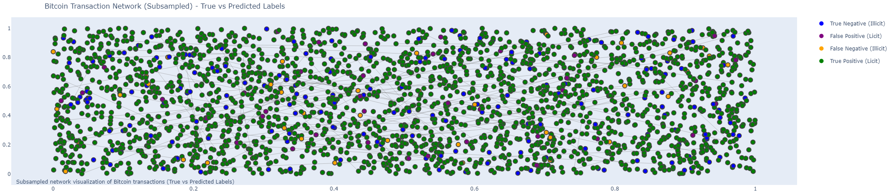

# Fraud Detection in Bitcoin Transactions using Graph Convolutional Networks (GCNs)

---

### **Project Description**
`bitcoin_fraud_detection` is a project aimed at detecting fraudulent Bitcoin transactions using Graph Convolutional Networks (GCNs). The project leverages the Elliptic dataset and combines the strengths of C++ for data preprocessing and Python for implementing and training the GCN model. This hybrid approach ensures efficient data handling and powerful machine learning capabilities.


---

### **Features**
- **Data Preprocessing in C++**: Efficient parsing and cleaning of transaction data.
- **Graph Construction**: Creation of a transaction graph using NetworkX.
- **Graph Neural Network (GNN)**: Implementation of a GNN using PyTorch Geometric for fraud detection.
- **Visualization**: Visualization of transaction graphs and model performance metrics using Plotly.

---

### **Project Structure**
```plaintext
bitcoin_fraud_detection/
│
├── data/
│   ├── filtered/
│   │   ├── filtered_classes.csv
│   │   ├── filtered_edgelist.csv
│   │   └── filtered_features.csv
│   └── unfiltered/
│       ├── elliptic_txs_classes.csv
│       ├── elliptic_txs_edgelist.csv
│       └── elliptic_txs_features.csv
│
├── src/
│   ├── data_preprocessing.cpp
│   └── CMakeLists.txt
│
├── training/
│   ├── data_preparation.ipynb
│   ├── gcn_model_weights.pth
│   ├── graph_data.pt
│   └── training.ipynb
│
├── visualization/
│   ├── data_plot.png
│   ├── data_predictions_plot.png
│   └── data_visualization.ipynb
│
├── README.md
└── LICENSE
```

### **Setup Instructions**

#### C++ Environment Setup
1. **Compile the C++ Code**:
   ```bash
   cd src
   mkdir build
   cd build
   cmake ..
   make
   ./data_preprocessing  

#### Python Environment Setup
1. **Install Python Dependencies**:
   ```bash
   cd training
   pip install -r requirements.txt
   ```

2. **Required Libraries**:
   - torch
   - torch-geometric
   - pandas
   - matplotlib
   - scipy
   - networkx
   - plotly
  
---

### **Running the Project**

#### 1. Data Preprocessing (C++):
Navigate to the `src` directory and run the data preprocessing script.
```bash
cd src/build
./data_preprocessing
```

This will generate filtered datasets in the `data/filtered/` directory using the `data/unfiltered/` directory. You might need to manually paste the data from Kaggle to `data/unfiltered/`, due to size limitations on Github.

#### 2. Training the GNN Model (Python):
Navigate to the `training` directory and run the `training.ipynb` notebook.
```bash
cd training
jupyter notebook training.ipynb
```

This will train the GNN model and save the model weights to `gcn_model_weights.pth`.

#### 3. Visualizing the Results (Python):
Navigate to the `visualization` directory and run the `data_visualization.ipynb` notebook.
```bash
cd visualization
jupyter notebook data_visualization.ipynb
```

### **Visualizations**

#### Data Plot


#### Data Predictions Plot


### **Usage**

- **Training**: The GNN model can be trained using the `training.ipynb` notebook. Adjust hyperparameters as needed within the notebook.
- **Visualization**: Use the `data_visualization.ipynb` notebook to generate visualizations of the transaction graph and model performance metrics.

### **License**
This project is licensed under the MIT License - see the [LICENSE](LICENSE) file for details.

### **Contributing**
Contributions are welcome! Please fork the repository and submit a pull request for any enhancements or bug fixes.

### **Acknowledgments**
- The Elliptic dataset: [Kaggle](https://www.kaggle.com/ellipticco/elliptic-data-set)
- PyTorch Geometric: [PyTorch Geometric](https://pytorch-geometric.readthedocs.io/en/latest/)

### **Contact**
For any questions or suggestions, please open an issue or contact the project maintainers.
